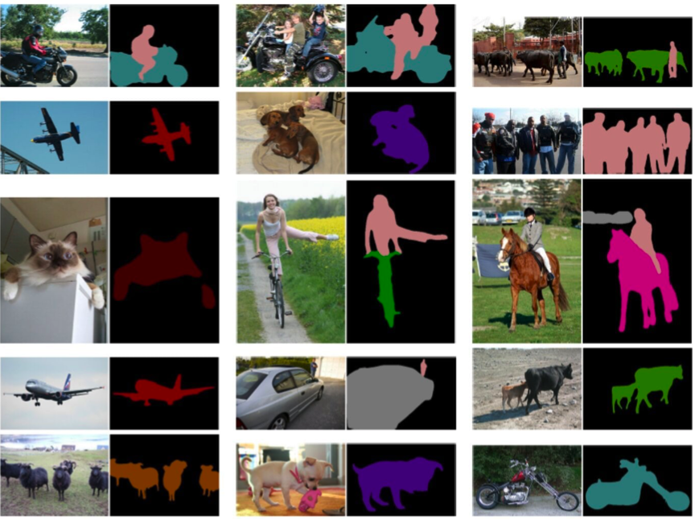

## Notes for Image Segmentation using deep learning

[toc]

### 1. About

This note is based on Image Segmentation Using Deep Learning: A Survey[Shervin Minaee et al.]. 

### 2. Introduction

**Traditional image segemtation algorithm**  includes thresholding, histogram-based bundling, region-growing, k-means clustering, watershed etc.

**More advanced algorithm** includes active contours, graph cuts, condition and Markov random fields and sparsity based methods

Recently, **deep learning networks** have yielded a new generation of image segemention models with **remarkable** performance improvements - often achieve highest accuracy rates on popular benchmarks - resulting in what many regard as a **paradigm shift** in the field.

Image above is sample outputs of a prominent deep learing model - DeepLabv3

According to main technical contributions, deep learning-based work can be divided into:

1. Fully convolutional networks
2. Convolutional models with graphical models
3. Encoder-decoder based models
4. Multi-scale and pyramid network based models
5. R-CNN based models(instance segementation)
6. Dilated convolutional networks
7. Recurrent neural network based models
8. Attention-based models
9. Generative models and adversarial training
10. Convolutional models with active contour models
11. Other

### 3. Overview of deep learning networks

#### 3.1 Convolutional Neural Networks (CNN)

