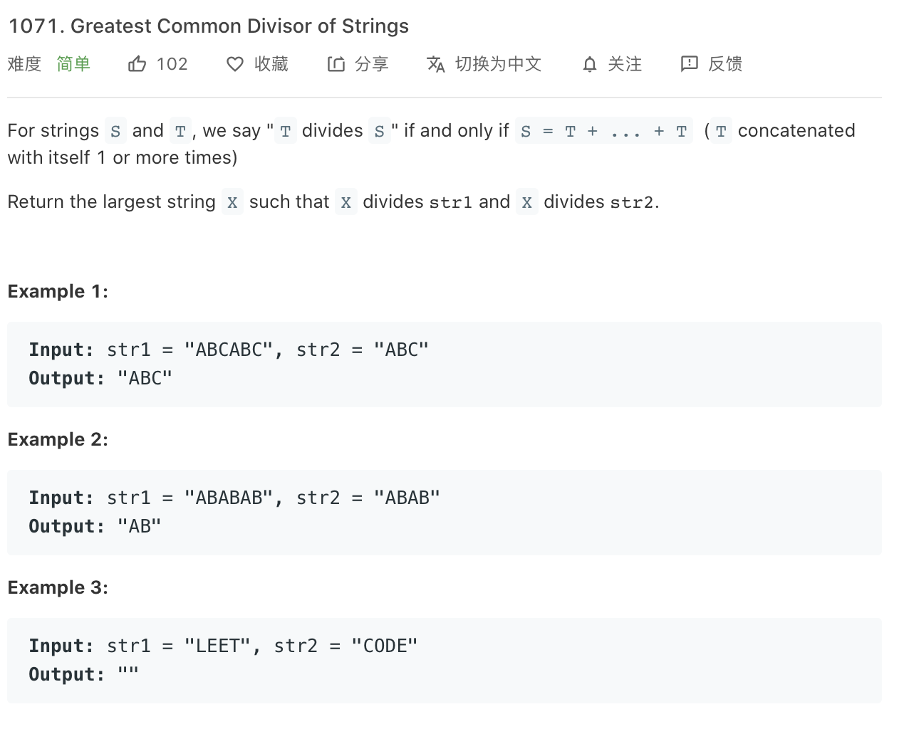

### Description

* **Level:** Easy
* **algorithm:**
* **requirement:**


### My final solution

```c++
class Solution {
public:
    string gcdOfStrings(string str1, string str2) {

        int max_length = gcd(str1.length(),str2.length());
        vector<int> pos_length = divisions(max_length);

        for(int i = pos_length.size()-1;i>=0;i--){
            string child = str1.substr(0,pos_length[i]);
            if(judgeDivide(str1, child)&&judgeDivide(str2, child))return child;
        }
        return "";
        
        

    }

    int gcd(int a,int b){
        int max_val = max(a,b);
        int min_val = min(a,b);
        int tmp = max_val%min_val;

        while(tmp!=0){
            
            max_val = max(min_val,tmp);
            min_val = min(min_val,tmp);
            tmp = max_val % min_val;
        }
        return min_val;
    }

    vector<int> divisions(int a){
        vector<int> result;
        result.push_back(1);

        for(int i = 2;i <= a;i++){
            if(a % i == 0)result.push_back(i);
        }
        return result;
    }

    bool judgeDivide(string mother,string child){
       
            int loop_val = mother.length()/child.length();
            int child_length = child.length();
           for(int i = 0;i < loop_val;i++)
           for(int j = 0;j < child_length;j++){
             if(mother[i*child_length+j]!=child[j])return false;
           }
            return true;
    }

};
```

pass

### Best solution

```C++
string gcdOfStrings(string str1, string str2) {
        if (str1 + str2 != str2 + str1) return "";
    return str1.substr(0, gcd(str1.size(), str2.size()));
    }
```

mathemetical algorithm

### Things i learned

* review string


