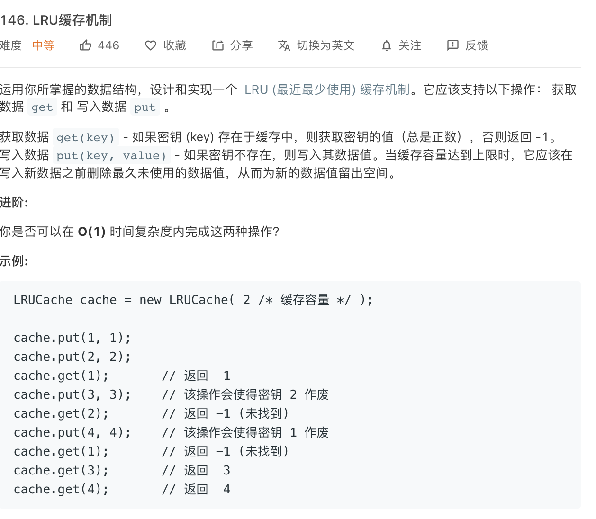

### Description

* **Level:** medium
* **algorithm:** Hash, List
* **requirement:**


### My final solution

```c++

```

Fail

### Best solution

```C++
class LRUCache {
private:
    int cap;
    // 双链表：装着 (key, value) 元组
    list<pair<int, int>> cache;
    // 哈希表：key 映射到 (key, value) 在 cache 中的位置
    unordered_map<int, list<pair<int, int>>::iterator> map;
public:
    LRUCache(int capacity) {
        this->cap = capacity; 
    }
    
    int get(int key) {
        auto it = map.find(key);
        // 访问的 key 不存在
        if (it == map.end()) return -1;
        // key 存在，把 (k, v) 换到队头
        pair<int, int> kv = *map[key];
        cache.erase(map[key]);
        cache.push_front(kv);
        // 更新 (key, value) 在 cache 中的位置
        map[key] = cache.begin();
        return kv.second; // value
    }
    
    void put(int key, int value) {

        /* 要先判断 key 是否已经存在 */ 
        auto it = map.find(key);
        if (it == map.end()) {
            /* key 不存在，判断 cache 是否已满 */ 
            if (cache.size() == cap) {
                // cache 已满，删除尾部的键值对腾位置
                // cache 和 map 中的数据都要删除
                auto lastPair = cache.back();
                int lastKey = lastPair.first;
                map.erase(lastKey);
                cache.pop_back();
            }
            // cache 没满，可以直接添加
            cache.push_front(make_pair(key, value));
            map[key] = cache.begin();
        } else {
            /* key 存在，更改 value 并换到队头 */
            cache.erase(map[key]);
            cache.push_front(make_pair(key, value));
            map[key] = cache.begin();
        }
    }
};
```


### Things i learned

* stl_list
* hash combined with list:**unordered_map<int,list<pair<int,int>>::iterator>**,to make put and get all O(1)
* assign() 给list赋值 
* back() 返回最后一个元素 
* begin() 返回指向第一个元素的迭代器 
* clear() 删除所有元素  
* empty() 如果list是空的则返回true  
* end() 返回末尾的迭代器  
* erase() 删除一个元素  
* front() 返回第一个元素 
* insert() 插入一个元素到list中  m
* ax_size() 返回list能容纳的最大元素数量 
* pop_back() 删除最后一个元素  p
* op_front() 删除第一个元素  
* push_back() 在list的末尾添加一个元素  
* push_front() 在list的头部添加一个元素 
* remove() 从list删除元素 
* resize() 改变list的大小  
* reverse() 把list的元素倒转  
* size() 返回list中的元素个数


