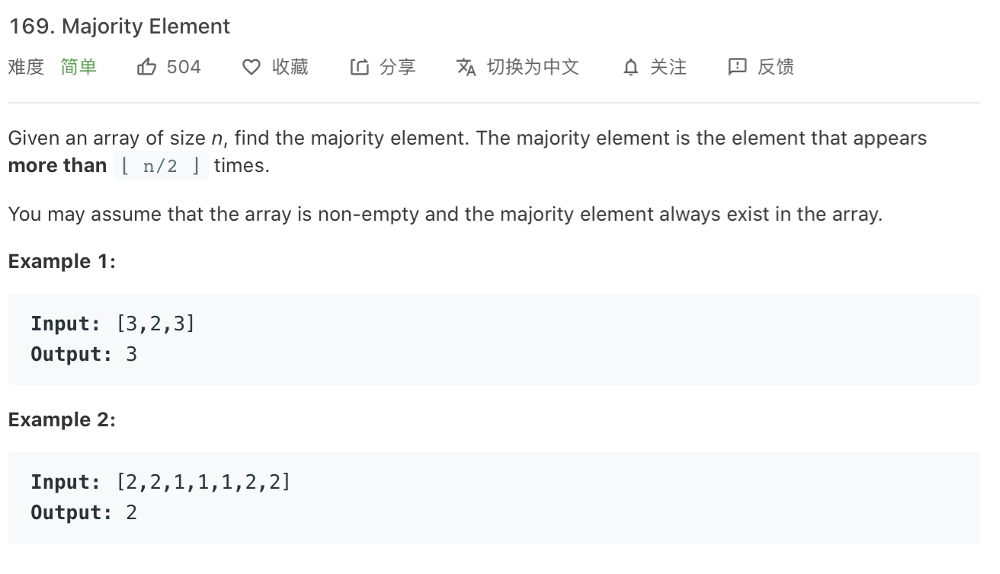

### Description

* **Level:** Easy
* **algorithm:**
* **requirement:**


### My final solution

```c++
int majorityElement(vector<int>& nums) {
        int size = nums.size(); 
        unordered_map <int,int> hash;
        for(int i = 0; i < nums.size();i++){
            hash[nums[i]]++;
        }
        for(auto x:hash){
            if(x.second > size/2)return x.first;
        }
        return -1;

    }
```

review how to use unordered map, when you want to search, it is faster to use unordered map rather than map

### Best solution

```C++
int majorityElement(vector<int>& nums) {
        int num=nums[0],count=1;
        for(int i=1;i<nums.size();i++){
            if(nums[i]==num) count++;
            else{
                count--;
                if(count<0){
                    num=nums[i];
                    count=1;
            }
        }}
        return num;
    }
```

首先我们根据算法步骤中对 count 的定义，可以发现：在对整个数组进行遍历的过程中，count 的值一定非负。这是因为如果 count 的值为 0，那么在这一轮遍历的开始时刻，我们会将 x 的值赋予 candidate 并在接下来的一步中将 count 的值增加 1。因此 count 的值在遍历的过程中一直保持非负。

那么 count 本身除了计数器之外，还有什么更深层次的意义呢？我们还是以数组

[7, 7, 5, 7, 5, 1 | 5, 7 | 5, 5, 7, 7 | 7, 7, 7, 7]
作为例子，首先写下它在每一步遍历时 candidate 和 count 的值：

nums:      [7, 7, 5, 7, 5, 1 | 5, 7 | 5, 5, 7, 7 | 7, 7, 7, 7]
candidate:  7  7  7  7  7  7   5  5   5  5  5  5   7  7  7  7
count:      1  2  1  2  1  0   1  0   1  2  1  0   1  2  3  4
我们再定义一个变量 value，它和真正的众数 maj 绑定。在每一步遍历时，如果当前的数 x 和 maj 相等，那么 value 的值加 1，否则减 1。value 的实际意义即为：到当前的这一步遍历为止，众数出现的次数比非众数多出了多少次。我们将 value 的值也写在下方：

nums:      [7, 7, 5, 7, 5, 1 | 5, 7 | 5, 5, 7, 7 | 7, 7, 7, 7]
value:      1  2  1  2  1  0  -1  0  -1 -2 -1  0   1  2  3  4
有没有发现什么？我们将 count 和 value 放在一起：

nums:      [7, 7, 5, 7, 5, 1 | 5, 7 | 5, 5, 7, 7 | 7, 7, 7, 7]
count:      1  2  1  2  1  0   1  0   1  2  1  0   1  2  3  4
value:      1  2  1  2  1  0  -1  0  -1 -2 -1  0   1  2  3  4
发现在每一步遍历中，count 和 value 要么相等，要么互为相反数！并且在候选众数 candidate 就是 maj 时，它们相等，candidate 是其它的数时，它们互为相反数！

为什么会有这么奇妙的性质呢？这并不难证明：我们将候选众数 candidate 保持不变的连续的遍历称为「一段」。在同一段中，count 的值是根据 candidate == x 的判断进行加减的。那么如果 candidate 恰好为 maj，那么在这一段中，count 和 value 的变化是同步的；如果 candidate 不为 maj，那么在这一段中 count 和 value 的变化是相反的。因此就有了这样一个奇妙的性质。

这样以来，由于：

我们证明了 count 的值一直为非负，在最后一步遍历结束后也是如此；

由于 value 的值与真正的众数 maj 绑定，并且它表示「众数出现的次数比非众数多出了多少次」，那么在最后一步遍历结束后，value 的值为正数；

在最后一步遍历结束后，count 非负，value 为正数，所以它们不可能互为相反数，只可能相等，即 count == value。因此在最后「一段」中，count 的 value 的变化是同步的，也就是说，candidate 中存储的候选众数就是真正的众数 maj。

### Things i learned

* Review hash
* Boyer-Moore


