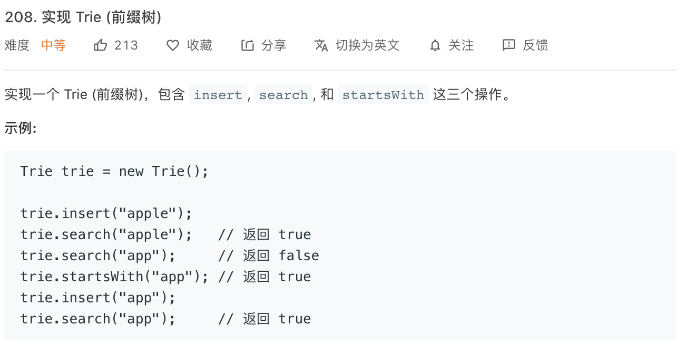

### Description

* **Level: **medium
* **algorithm:** trie
* **requirement:**



###Things i learned

Trie is a kind of data structure used to search intensive keys in a database. eg autocomplete/spelling check/Ip route.

Why trie but not hash table?

* find all keys with the same prefix
* List in dictionary sequence
* avoid confilct when facing large scale data

Solution in leetcode(Java):

```java
class TrieNode {

    // R links to node children
    private TrieNode[] links; 
  
  	private TriNode root;

    private final int R = 26; //26 characters in English

    private boolean isEnd;

    public TrieNode() {
        links = new TrieNode[R];
      	root = new TrieNode();
    }

    public boolean containsKey(char ch) {
        return links[ch -'a'] != null;
    }
    public TrieNode get(char ch) {
        return links[ch -'a'];
    }
    public void put(char ch, TrieNode node) {
        links[ch -'a'] = node;
    }
    public void setEnd() {
        isEnd = true;
    }
    public boolean isEnd() {
        return isEnd;
    }
  
   // Inserts a word into the trie.
    public void insert(String word) {
        TrieNode node = root;
        for (int i = 0; i < word.length(); i++) {
            char currentChar = word.charAt(i);
            if (!node.containsKey(currentChar)) {
                node.put(currentChar, new TrieNode());
            }
            node = node.get(currentChar);
        }
        node.setEnd();
    }
     private TrieNode searchPrefix(String word) {
        TrieNode node = root;
        for (int i = 0; i < word.length(); i++) {
           char curLetter = word.charAt(i);
           if (node.containsKey(curLetter)) {
               node = node.get(curLetter);
           } else {
               return null;
           }
        }
        return node;
    }

    // Returns if the word is in the trie.
    public boolean search(String word) {
       TrieNode node = searchPrefix(word);
       return node != null && node.isEnd();
    }
}


}

```

### My final solution

Rewrite in C++

```c++
class Trie {
private:
bool isEnd;
Trie *links[26] = {NULL};


public:
    /** Initialize your data structure here. */
    Trie() {
        this->isEnd = false;
    }

    bool containsKey(char ch){
        return links[ch - 'a'] != NULL;
    }

    Trie* get(char ch){
        return links[ch - 'a'];
    }
    
    void put(char ch, Trie* node){
        links[ch - 'a'] = node;
    }

    void setEnd(){
        this->isEnd = true;
    }

    bool getEnd(){
        return this->isEnd;
    }

    /** Inserts a word into the trie. */
    void insert(string word) {
        Trie* cur_node = this;
        for(int i = 0;i < word.length();i++){
            char current_char = word[i];
            if(!cur_node->containsKey(current_char)){
                cur_node->put(current_char, new Trie());
            }
            cur_node = cur_node->get(current_char);
        }
        cur_node->setEnd();
    }

    //return node that start with 'word'
    Trie* getPrefix(string word){
        Trie* cur_node = this;
        for(int i = 0; i < word.length();i++){
            char current_char = word[i];
            if(cur_node->containsKey(current_char)){
               cur_node = cur_node->get(current_char);
            }else{
                return NULL;
            }
        }
        return cur_node;
    }
    
    /** Returns if the word is in the trie. */
    bool search(string word) {
        Trie* node = getPrefix(word);
        return node&&node->getEnd();
    }
    
    /** Returns if there is any word in the trie that starts with the given prefix. */
    bool startsWith(string prefix) {
        return getPrefix(prefix);

    }
};
```

### 


