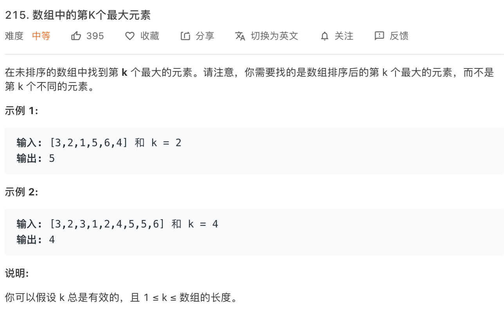

### Description

* **Level:** Medium
* **algorithm:** Heap, quick sort
* **requirement:**


### My final solution

```c++
class Solution {
public:
    int findKthLargest(vector<int>& nums, int k) {
        priority_queue<int, vector<int>, greater<int>> heap;

        for(int i = 0 ; i < nums.size();i++){
            if(heap.size() < k){
                heap.push(nums[i]);
            }else if(nums[i] > heap.top()){
                heap.pop();
                heap.push(nums[i]);
            }
        }
        return heap.top();
    }
};
```

priotity queue is a stl data structure in C++. Here i use it as a minHeap(the third param when initializing is greater<int> called functional class);

Priority queue includes methods like top()/empty()/size()/push()/emplace()/pop()/swap()

```c++
class Solution {
public:
    //k small
    int findKthLargest(vector<int>& nums, int k) {
        k = nums.size() - k + 1;
        int pivot = 0;
        return Paritition(nums, 0, nums.size() - 1,  k);


    }
    int Paritition(vector<int> &nums,int start,int end,int k)
    {   
        if(start >= end)return nums[start];
        int pivot = nums[start];
        int pivot_pos = start;
        for(int i = start + 1;i <= end;i++){
            if(pivot > nums[i]){
                pivot_pos++;
               if(pivot_pos != i) swap(nums[pivot_pos],nums[i]);
               
                
        }
    }
        nums[start] = nums[pivot_pos];
        nums[pivot_pos] = pivot;

        if(pivot_pos == k - 1)return nums[pivot_pos];
        else if(pivot_pos > k - 1)return Paritition(nums, start, pivot_pos - 1, k);
        else return Paritition(nums, pivot_pos + 1, end, k);
        }


};
```

based on quick sort 

### Best solution

```C++
class Solution {
public:
    int partition(vector<int> &nums, int left, int right)
    {
        srand(time(nullptr));
        int pivot_index=rand() % (right-left+1) + left;//[left,right]范围内的随机数
        int pivot=nums[pivot_index];
        swap(nums[pivot_index],nums[right]);//交换pivot和最后一个元素的位置
        int i,j=left;
        for(i=left;i<right;++i)
        {
            if(nums[i]<pivot)
            {
                swap(nums[i],nums[j]);
                j++;
            }
        }
        swap(nums[right],nums[j]);//交换num[j]和pivot的位置，此时j即为pivot最终位置
        return j;
    }

    int quickSelect(vector<int> &nums,int left, int right, int k)
    {
        if(left==right)
            return nums[left];
        int pos=partition(nums,left,right);
        if(pos == nums.size()-k)
            return nums[pos];
        else if(pos < nums.size()-k)
            return quickSelect(nums,pos+1,right,k);
        return quickSelect(nums,left,pos-1,k);
    }

    int findKthLargest(vector<int>& nums, int k) {
        return quickSelect(nums,0,nums.size()-1,k);
    }
};
```

two pointer quick sort;

### Things i learned

* minHeap and quick sort


