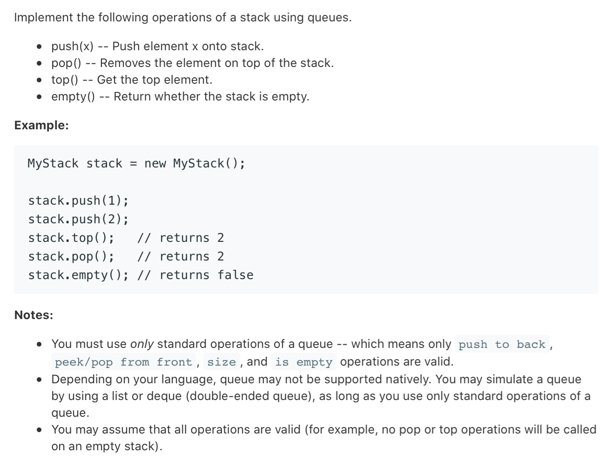

### Description

* **Level:** Easy
* **algorithm:**
* **requirement:**


### My final solution

```c++
class MyStack {
private:queue<int> *my_queue;
public:
    /** Initialize your data structure here. */
    MyStack() {
        my_queue = new queue<int>();
    }
    
    /** Push element x onto stack. */
    void push(int x) {

        my_queue->push(x);

    }
    
    /** Removes the element on top of the stack and returns that element. */
    int pop() {

        queue<int> *new_queue = new queue<int>();
        int size = my_queue->size();
        for(int i = 0;i < size - 1;i++){
            new_queue->push(my_queue->front());
            my_queue->pop();
        }
        int return_val = my_queue->front();
        my_queue = new_queue;
        return return_val;

    }
    
    /** Get the top element. */
    int top() {
        int temp;
        int size = my_queue->size(); 
        queue<int> *new_queue = new queue<int>();
        for(int i = 0;i < size;i++){
            new_queue->push(my_queue->front());
            if(i == size - 1)temp = my_queue->front();
            my_queue->pop();
        }

        my_queue = new_queue;
        return temp;

    }
    
    /** Returns whether the stack is empty. */
    bool empty() {
        return my_queue->empty();
    }
};
```

Two queue, add a new queue to store;

### Best solution

```C++
class MyStack {
public:
    /** Initialize your data structure here. */
    MyStack() {

    }

    queue<int> data;
    
    /** Push element x onto stack. */
    void push(int x) {
        data.push(x);
        // 除了刚插入的元素，其余重置
        for(int i=0; i<data.size()-1; i++){
            data.push(data.front());
            data.pop();
        }
    }
    
    /** Removes the element on top of the stack and returns that element. */
    int pop() {
        int x = data.front();
        data.pop();
        return x;
    }
    
    /** Get the top element. */
    int top() {
        return data.front();
    }
    
    /** Returns whether the stack is empty. */
    bool empty() {
        return data.empty();
    }
};
```

one queue, make the first one to bottom when pushing.

### Things i learned

* queue and stack in C++


