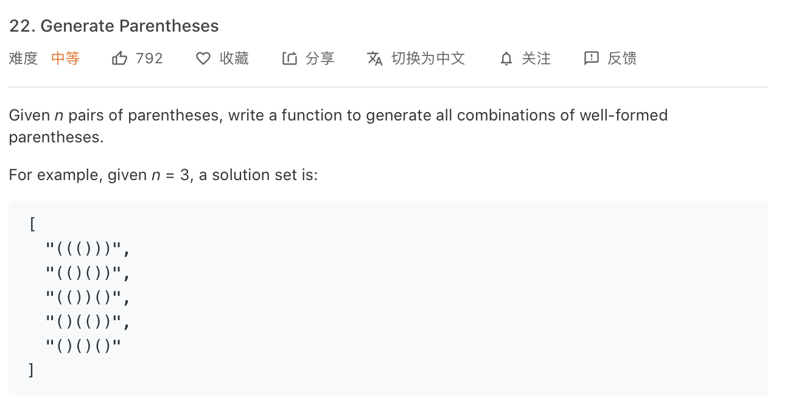

### Description

* **Level:** medium

* **algorithm:** dfs/dp

* **requirement:** 

  


### My final solution

```c++
class Solution {
public:
    vector<string> generateParenthesis(int n) {
        vector<string> result;
        dfs(0,0,"",n,&result);
        return result;
    }

    void dfs(int stack_left,int cur_left,string cur_str,int total_left,vector<string> *result){
        if(cur_str.length() == total_left * 2){result->push_back(cur_str);return;}

        else{
            if(cur_left == total_left)dfs(stack_left-1,cur_left,cur_str+")",total_left,result);
            else if(stack_left == 0)dfs(stack_left+1,cur_left+1,cur_str+"(",total_left,result);
            else {
                dfs(stack_left-1,cur_left,cur_str+")",total_left,result);
                dfs(stack_left+1,cur_left+1,cur_str+"(",total_left,result);
            }
           
        }
        return;

        
    }
};
```

pass,Dfs is followed by two principle:

* when stack is empty, only enter '('
* When "(" is more than total, only enter ")"

### Best solution

```C++
 vector<string> generateParenthesis(int n) {
        if(n==0){return {""};}
        if(n==1){return {"()"};}
        vector<vector<string>> dp(n+1);
        dp[0].push_back("");
        dp[1].push_back("()");
        for(int i=2;i<=n;i++){
            for(int j=0;j<i;j++){
                for(string p:dp[j]){
                    for(string q:dp[i-j-1]){
                        string str="("+p+")"+q;
                        dp[i].push_back(str);
                    }
                }
            }
        }
        return dp[n];
    }
};
```

Dp, as for a new parenthesis, it can **contain** the old ones or **outside** of the old ones

only care about the new parenthesis, no repeat, no left

### Things i learned

* dfs and dp


