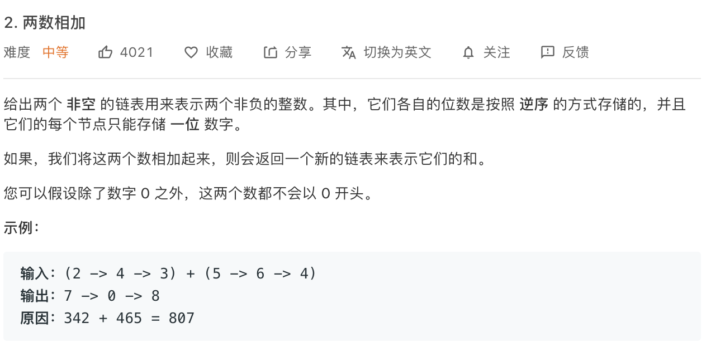

### Description

* **Level:** medium
* **algorithm:** math
* **requirement:**


### My final solution

```c++
ListNode* addTwoNumbers(ListNode* l1, ListNode* l2) {
       if(l1==NULL)return l2;
       if(l2==NULL)return l1;
       int tmp = l1->val + l2->val;

        if(l1->next == NULL && l2->next == NULL && tmp > 9){
            ListNode *result = new ListNode(tmp%10);
            result->next = new ListNode(1);
            return result;
        }


       int add = tmp > 9?1:0;
       ListNode *result = new ListNode(tmp%10);
       ListNode *cur_result = result;

       l1 = l1->next;
       l2 = l2->next;

       
        while(l2!=NULL)
        {
            if(l1 == NULL){
                if(add == 0)cur_result->next = l2;      
                else cur_result->next = addTwoNumbers(l2,new ListNode(1));
       return result;
            }
             tmp = l1->val + l2->val + add;
             add = tmp > 9?1:0;
            cur_result->next = new ListNode(tmp%10);
            cur_result = cur_result->next;
            l1 = l1->next;
            l2 = l2->next;
        }
    if(add == 0)cur_result->next = l1;      
    else cur_result->next = addTwoNumbers(l1,new ListNode(1));
    return result;
       
        

    }
```

pass, recurrance but slow

### Best solution

```C++
ListNode* addTwoNumbers(ListNode* l1, ListNode* l2) {
        int carry = 0;
        int cur = 0;
        //ListNode* p1 = l1;
        //ListNode* p2 = l2;
        ListNode* res = new ListNode(-1);
        ListNode* tail = res;

        while(l1 != NULL || l2 != NULL){
            if(l1 == NULL){
                cur = l2->val + carry;
                cur > 9 ? carry = 1 : carry = 0;
                cur = cur % 10;
                ListNode* q = new ListNode(cur);
                tail->next = q;
                tail = tail->next;
                l2 = l2->next;
            }else if(l2 == NULL){
                cur = l1->val + carry;
                cur > 9 ? carry = 1 : carry = 0;
                cur = cur % 10;
                ListNode* q = new ListNode(cur);
                tail->next = q;
                tail = tail->next;
                l1 = l1->next;
            }else{
                cur = l1->val + l2->val + carry;
                cur > 9 ? carry = 1 : carry = 0;
                cur = cur % 10;
                ListNode* q = new ListNode(cur);
                tail->next = q;
                tail = tail->next;
                l1 = l1->next;
                l2 = l2->next;
            }
        }
        if(carry == 1){
            ListNode* q = new ListNode(1);
            tail->next = q;
            tail = tail->next;
        }
        return res->next;
    }
```

Final goal is to make two pointer be null at the same time

### Things i learned

* make your mind clear bbefore code


