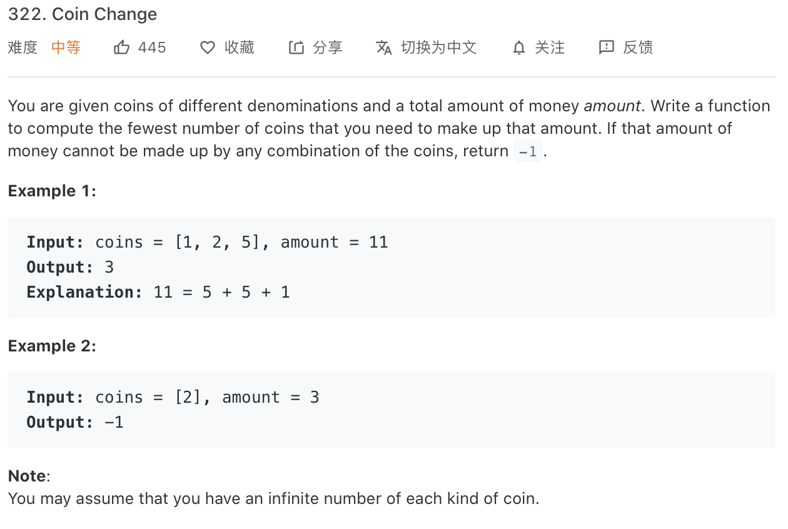

### Description

* **Level:** medium
* **algorithm:** DP,DFS
* **requirement:** 


### My final solution

```c++
 int coinChange(vector<int>& coins, int amount) {
        
        sort(coins.begin(),coins.end());

        return sortCoinChange(coins, amount,coins.size()-1);
        
        
    }

    int sortCoinChange(vector<int>& coins, int amount,int end){
        if(amount == 0)return 0;
        if(coins[0] == amount)return 1;
        else if(coins[0] > amount)return -1;

        int result = INT_MAX;

        for(int i = end;i >= 0;i--){

            int cur_result = sortCoinChange(coins, amount - coins[i],i);
            if(cur_result != -1 && cur_result < result)result = cur_result;
            
        }
        if(result == INT_MAX)return -1;
        else return result+1;


    }
```

dp, but TLE.

```C++
 vector<int> rem;
    int coinChange(vector<int>& coins, int amount) {
        
        sort(coins.begin(),coins.end());
        rem.resize(amount+1);

        return sortCoinChange(coins, amount);
        
        
    }

    int sortCoinChange(vector<int>& coins, int amount){
        if(amount == 0)return 0;
        if(coins[0] == amount)return 1;
        else if(coins[0] > amount)return -1;

        if(rem[amount]!=0)return rem[amount];

        int result = INT_MAX;

        for(int i = 0;i < coins.size();i++){

            if(amount >= coins[i]){
            int cur_result = sortCoinChange(coins, amount - coins[i]);

            rem[amount-coins[i]] = cur_result;

            if(cur_result != -1 && cur_result < result)result = cur_result;
            }
            
        }
        if(result == INT_MAX)return -1;
        else return result+1;
    }
```

add storage vector, finally passed but slow.

### Best solution

top to bottom

```C++
class Solution {
    vector<int>count;
    int dp(vector<int>& coins, int rem) {
        if (rem < 0) return -1;
        if (rem == 0) return 0;
        if (count[rem - 1] != 0) return count[rem - 1];
        int Min = INT_MAX;
        for (int coin:coins) {
            int res = dp(coins, rem - coin);
            if (res >= 0 && res < Min) {
                Min = res + 1;
            }
        }
        count[rem - 1] = Min == INT_MAX ? -1 : Min;
        return count[rem - 1];
    }
public:
    int coinChange(vector<int>& coins, int amount) {
        if (amount < 1) return 0;
        count.resize(amount);
        return dp(coins, amount);
    }
};
```

bottom to top

```C++
class Solution {
public:
    int coinChange(vector<int>& coins, int amount) {
        int Max = amount + 1;
        vector<int> dp(amount + 1, Max);
        dp[0] = 0;
        for (int i = 1; i <= amount; ++i) {
            for (int j = 0; j < (int)coins.size(); ++j) {
                if (coins[j] <= i) {
                    dp[i] = min(dp[i], dp[i - coins[j]] + 1);
                }//核心是在此处更新dp数组
            }
        }
        return dp[amount] > amount ? -1 : dp[amount];
    }
};
```

dfs+greedy:

```c++
class Solution {
    //贪心+dfs最快算法，尽可能多的用大硬币
public:
    int coinChange(vector<int>& coins, int amount) {
        int res = INT_MAX;
        sort(coins.begin(),coins.end());//将硬币从小到大排序
        helper(coins,amount,coins.size()-1,0,res);
        return res==INT_MAX?-1:res;
    }

    /*
    @param coins:硬币数组
    amount:当前要合成的钱
    start:开始计算的位置，排好序后从大到小算
    cur:当前已经花了几枚硬币
    res:局部最优解
    */

    void helper(vector<int>& coins, int amount, int start,int cur, int& res){
        if(start<0) return;
        if(amount%coins[start]==0){
            res = min(res, cur+amount/coins[start]);
            return;
        }
        //i代表本次要用多少枚硬币
        for(int i = amount/coins[start]; i >=0; i--){
            if(cur+i>=res-1)break;//这处优化很关键，由于已知到此处花了多少硬币（cur），所以可以直接靠这个数筛掉许多可能性
            helper(coins,amount-i*coins[start],start-1,cur+i,res);
        }
    }
};
```


### Things i learned

* revise dp in two ways
* revise dfs


