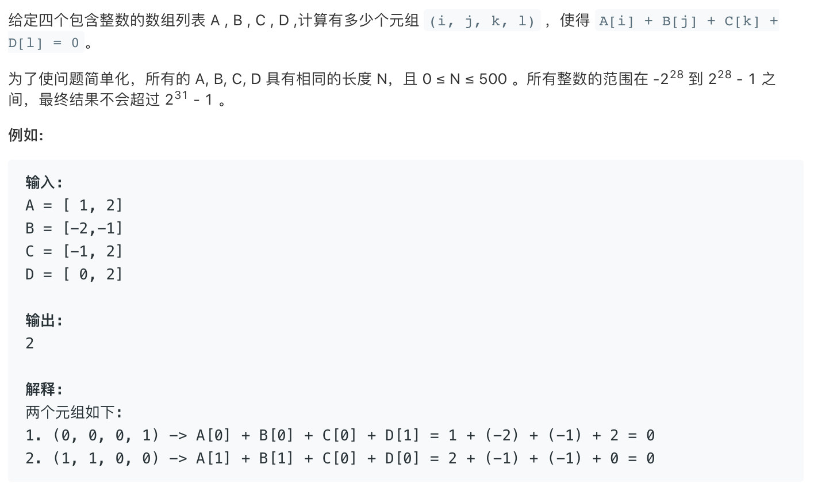

### Description

* **Level:** medium
* **algorithm:** Hash
* **requirement:**


### My  solution

```c++
class Solution {
public:
    int fourSumCount(vector<int>& A, vector<int>& B, vector<int>& C, vector<int>& D) {
        int result = 0;
        for(int i = 0;i < A.size();i++)
        for(int j = 0;j < B.size();j++)
        for(int k = 0;k < C.size();k++)
        for(int l = 0;l < D.size();l++)
        if(A[i] + B[j] + C[k] + D[l] == 0)result++;
        return result;
    }
};
```

Simple brute force and TLE

```c++
class Solution {
public:
    int fourSumCount(vector<int>& A, vector<int>& B, vector<int>& C, vector<int>& D) {
        int result = 0;
       sort(A.begin(), A.end());
       sort(B.begin(), B.end());
       sort(C.begin(), C.end());
       sort(D.begin(), D.end());
        for(int i = 0;i < A.size();i++)

        for(int j = 0;j < B.size();j++)

        for(int k = 0;k < C.size();k++)

        for(int l = 0;l < D.size();l++){
            if(A[i] + B[j] + C[k] + D[l] == 0)result++;
            else if(A[i] + B[j] + C[k] + D[l] > 0){
                if(k + 1 < C.size()){k++;l=-1;}
                else if(j + 1 < B.size()){j++;k=0;l=-1;}
                else if(i + 1 < A.size()){i++;j=0;k=0;l=-1;}
                else return result;
                
            }

        }    
        return result;
    }
};
```

optimize by sort. still TLE.

failed to finish it.

### Best solution

```C++
class Solution {
public:
       int fourSumCount(vector<int>& A, vector<int>& B, vector<int>& C,vector<int>D) {
        unordered_map<int,int> hash;
        const int N=A.size();
        for(int i=0;i<N;++i){
            for(int j=0;j<N;++j){
                ++hash[A[i]+B[j]]; //faster using ++ than insert()
            }
        }
        
        int ans = 0;
        for(int i=0;i<N;++i){
            for(int j=0;j<N;++j){
                int t=C[i]+D[j];
                if(hash.count(-t)){ //faster using count() instead of []
                    ans += hash[-t];
                }
            }
        }
        return ans;
    }
};
```

### Things i learned

* A + B + C + D == 0 equals to (A + B) = -(C + D), based on this concept we may apply hash table for a space-time trade.
* Hash table in STL include map and unordered map. unordered map will cosume more space but will be rather faster.


