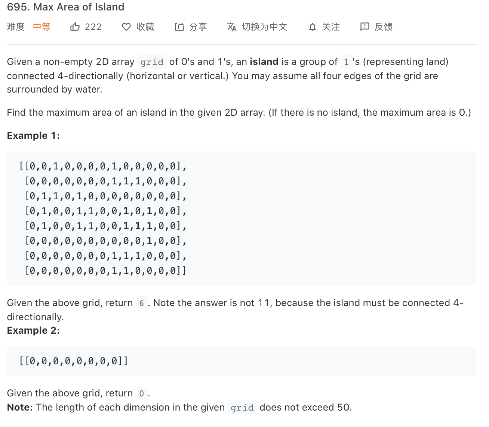

### Description

* **Level:** Medium
* **algorithm:** dfs/bfs
* **requirement:**


### My final solution

```c++
class Solution {
public:
    int maxAreaOfIsland(vector<vector<int>>& grid) {
        int result = 0;
        for(int i = 0;i < grid.size();i++)
        for(int j = 0;j < grid[0].size();j++){
            if(grid[i][j] == 1){
                result = max(result,dfs(grid,i,j));
            }
        }
        return result;


    }

   int dfs(vector<vector<int>>& grid,int x,int y){
       int result = 1;
       grid[x][y] = 0;
       if(x-1 >= 0 && grid[x-1][y] == 1)result+=dfs(grid,x-1,y);
       if(y-1 >= 0 && grid[x][y-1] == 1)result+=dfs(grid,x,y-1);
       if(x+1 < grid.size() && grid[x+1][y] == 1)result+=dfs(grid,x+1,y);
       if(y+1 < grid[0].size() && grid[x][y+1] == 1)result+=dfs(grid,x,y+1);
       return result;

   }


};
```

Dfs, easy one

### Best solution

```C++
class Solution {
public:
    int maxAreaOfIsland(vector<vector<int>>& grid) {
        int ans = 0;
        for (int i = 0; i != grid.size(); ++i)
            for (int j = 0; j != grid[0].size(); ++j) {
                int cur = 0;
                queue<int> queuei;
                queue<int> queuej;
                queuei.push(i);
                queuej.push(j);
                while (!queuei.empty()) {
                    int cur_i = queuei.front(), cur_j = queuej.front();
                    queuei.pop();
                    queuej.pop();
                    if (cur_i < 0 || cur_j < 0 || cur_i == grid.size() || cur_j == grid[0].size() || grid[cur_i][cur_j] != 1)
                        continue;
                    ++cur;
                    grid[cur_i][cur_j] = 0;
                    int di[4] = {0, 0, 1, -1};
                    int dj[4] = {1, -1, 0, 0};
                    for (int index = 0; index != 4; ++index) {
                        int next_i = cur_i + di[index], next_j = cur_j + dj[index];
                        queuei.push(next_i);
                        queuej.push(next_j);
                    }
                }
                ans = max(ans, cur);
            }
        return ans;
    }
};

```

bfs with queue, slow and space-consuming

### Things i learned

* Can pre-calculate the vector size to make it even faster : m = vector.size()/n = vector[0].size()


