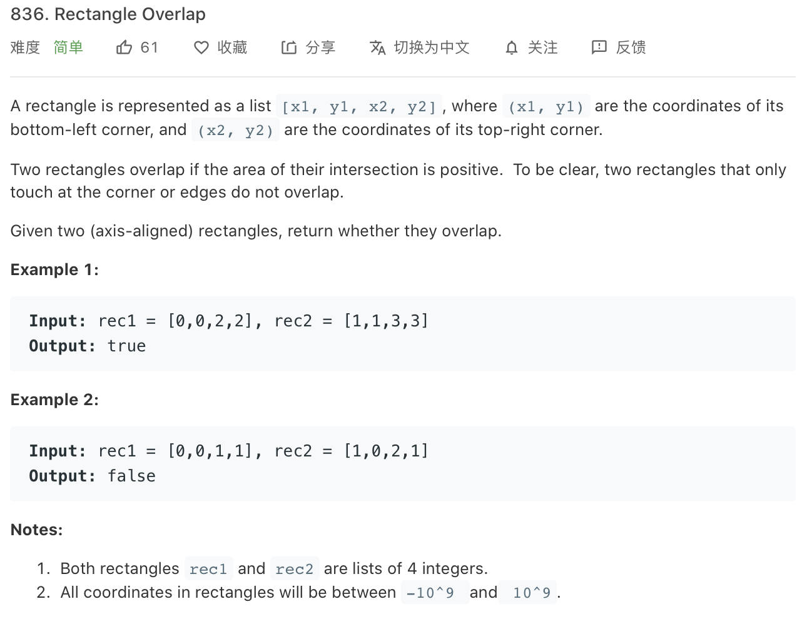

### Description

* **Level:** easy
* **algorithm:** graphics
* **requirement:**




### My final solution

```c++

```

Fail to measure one easy solution

### Best solution

```C++
class Solution {
public:
    bool isRectangleOverlap(vector<int>& rec1, vector<int>& rec2) {     return !(rec2[0] >= rec1[2] || rec1[0] >= rec2[2] || rec1[1] >= rec2[3]||rec2[1] >= rec1[3]);
    }
};
```

consider when they are **not** overlap or the overlapped rectangle

### Things i learned

* reverse thinking


