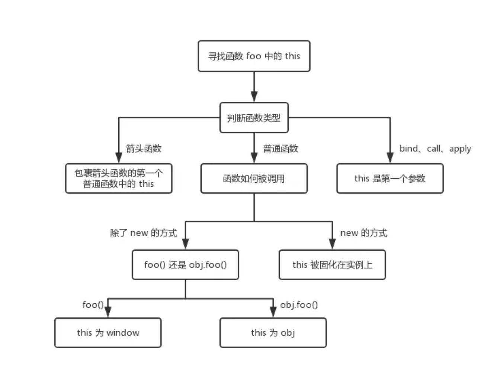

#### 2020/03/18

## 原始类型

js中原始值有六种：

* boolean(true, false)
* null
* undefined
* number
* string
* symbol

这些原始类型存储的都是值，是没有函数可以调用的

`'1'.toString()` 是可以使用的。其实在这种情况下，`'1'` 已经不是原始类型了，而是被强制转换成了 `String` 类型也就是对象类型，所以可以调用 `toString` 函数。

String和string不一样

null并不是对象而是一种基本类型，typeof null输出object是一个bug

## 对象（object）类型

除了原始类型其他都是对象类型。原始类型存储的是值，对象类型存储的是指针。

```javascript
const a = []
```

对于常量 `a` 来说，假设内存地址（指针）为 `#001`，那么

在地址 `#001` 的位置存放了值 `[]`

常量 `a` 存放了地址（指针） `#001`

a -> #001 -> []

```javascript
const a = []
const b = a
b.push(1)
```

在这种情况下，由于传递的是指针，所以a的值也会改变

注：对于const修饰对象类型，只能保证被修饰的指针不发生改变，不保证指针指向内容的改变

```javascript
function test(person) {
  person.age = 26
  person = {
    name: 'yyy',
    age: 30
  }

  return person
}
const p1 = {
  name: 'yck',
  age: 25
}
const p2 = test(p1)
console.log(p1) // yck,26
console.log(p2) // yyy,30
```

由于传入的是对象指针的副本，所以第一个输出时p1也会被改变

之后为person，也就是传入的指针副本重新分配了一个地址，再返回时已经和p1没有关系

## typeof 和 instanceof

`typeof` 对于原始类型来说，除了 `null` 都可以显示正确的类型（null如前文所说会输出object）

```javascript
typeof 1 // 'number'
typeof '1' // 'string'
typeof undefined // 'undefined'
typeof true // 'boolean'
typeof Symbol() // 'symbol'
```

Symbol()是ES6新基本类型，用于表示一个对象某个**唯一的**属性，用Symbol()创建。

```javascript
const shapeType = {
  triangle: Symbol()
};
```

会像这样作为类的某个属性

`typeof` 对于对象来说，除了函数都会显示 `object`，所以说 `typeof` 并不能准确判断变量到底是什么类型

```javascript
typeof [] // 'object'
typeof {} // 'object'
typeof console.log // 'function'
```

如果我们想判断一个对象的正确类型，这时候可以考虑使用 `instanceof`，因为内部机制是通过原型链来判断的

```javascript
const Person = function() {}
const p1 = new Person()
p1 instanceof Person // true

var str = 'hello world'
str instanceof String // false，typeof输出基本类型string

var str1 = new String('hello world')
str1 instanceof String // true
```

instanceof不能直接判断原始类型，会返回原始类型not defined

## this指针

```javascript
function foo() {
  console.log(this.a)
}
var a = 1
foo()

const obj = {
  a: 2,
  foo: foo
}
obj.foo()

const c = new foo()
```

* 若直接调用foo()，this一定是window
* 对于obj.foo()，谁调用了这个函数谁就是this
* 若new创建，foo永远被绑定在了c上

对于箭头函数：

```javascript
function a() {
  return () => {
    return () => {
      console.log(this)
    }
  }
}
console.log(a()()())
```

首先箭头函数其实是没有 `this` 的，箭头函数中的 `this` 只取决包裹箭头函数的第一个普通函数的 `this`。在这个例子中，因为包裹箭头函数的第一个普通函数是 `a`，所以此时的 `this` 是 `window`。另外对箭头函数使用 `bind` 这类函数是无效的。

其中有三个函数可以改变this的指向：

* call()：第一个参数代表this指针的指向，后续的参数用逗号分隔
* apply()：第一个参数代表this指针的指向，后续的参数以数组形式传入
* bind()：参数类型同call，后续用逗号分隔，返回一个函数，故最后要加一个括号

有图如下：




