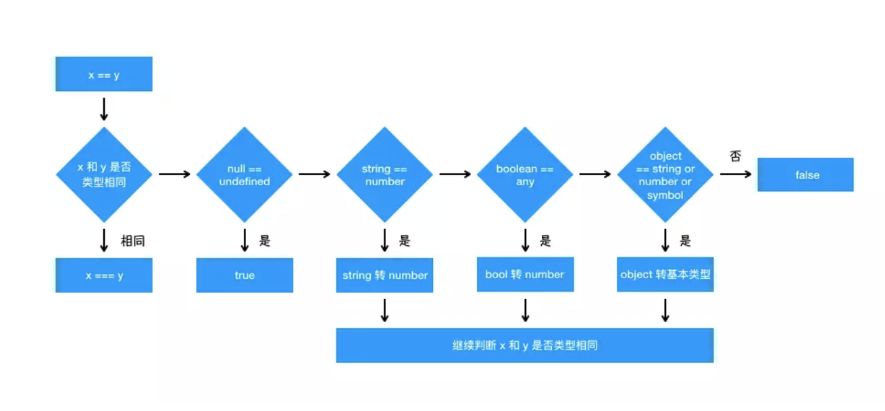

## ==和===

对于 `==` 来说，如果对比双方的类型**不一样**的话，就会进行**类型转换**



## 闭包

闭包的定义其实很简单：函数 A 内部有一个函数 B，函数 B 可以访问到函数 A 中的变量，那么函数 B 就是闭包。

向上寻找。

```javascript
function A() {
  let a = 1
  window.B = function () {
      console.log(a)
  }
}
A()
B() // 1
```

B函数可以访问A中的变量

## ES6 var, const , let

#### var的声明会发生提升

```javascript
console.log(a) // undefined
var a = 1
```

等价于

```javascript
var a
console.log(a) // undefined
a = 1
```

但是赋值不会提升，下面的例子：

```javascript
var a = 10
var a
console.log(a)
```

等价于

```javascript
var a
var a
a = 10
console.log(a)
```

所有声明都将被提升，且函数提升的优先级高于变量

但是let和const无法提升，你没有声明就没有办法使用。

- 函数提升优先于变量提升，函数提升会把整个函数挪到作用域顶部，变量提升只会把声明挪到作用域顶部
- `var` 存在提升，我们能在声明之前使用。`let`、`const` 因为暂时性死区的原因，不能在声明前使用
- `var` 在全局作用域下声明变量会导致变量挂载在 `window` 上，其他两者不会
- `let` 和 `const` 作用基本一致，但是后者声明的变量不能再次赋值

```javascript
for (let i = 1; i <= 5; i++) {
  setTimeout(function timer() {
    console.log(i)
  }, i * 1000)
}
```

在这种情况下虽然setTimeout是异步函数，但由于需要等待i所以可以输出递增。

